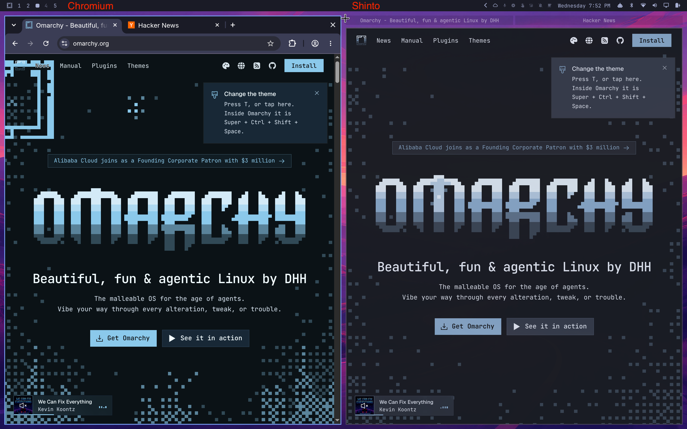

# Shinto

```bash
curl -fsSL https://raw.githubusercontent.com/ijt/shinto/main/install.sh | bash
```


*Chromium on the left, Shinto on the right.*

*Chromium has too much chrome; Zen isn't zen enough.*

*Shinto renders unto the window management gods what is theirs.*

Most web browsers have tabs and sometimes even window splitting to work around not having those in the host window system. In Omarchy, we have a great window manager hyprland with tiling and tabs, so why does the browser need to have its own tabs? It doesn't! That's why Shinto doesn't have them, or any other junk that gets in the way of you joyfully viewing your web pages.


*Hyprland groups are the tabs. `Ctrl+T` opens a new one.*

## Why it starts quickly

The app itself is the warm daemon — no separate hidden window needed to keep it alive. `shinto.service` runs it with zero windows open; opening a page asks the already-running process for a new window over a local socket. Warm opens measure well under 150ms, not seconds.

## What Shinto is (and is not)

| Is | Is not |
|----|--------|
| Default *page* browser (links, Super+Shift+B once set) | Omarchy webapp host (`--app=` stays on Chromium) |
| One window per page; Hyprland groups are tabs | An extension platform |
| Theme-aware omnibox via Omarchy hooks | A full Chrome/Firefox replacement for every workflow |

Chromium remains the right tool for Omarchy web apps and bundled Chromium extensions. Shinto is for reading the web on a tiling compositor.

## Install

### One-line (Omarchy)

```bash
curl -fsSL https://raw.githubusercontent.com/ijt/shinto/main/install.sh | bash
```

[`install.sh`](install.sh) installs any missing packages via `pacman`
(asking first), clones to `~/.local/share/shinto/src` (or updates it if
it's already there -- re-running this line later is how you upgrade),
and does exactly what "From source" below does. Read it before piping it
into `bash` if you'd rather not take that on faith.

### From source (Omarchy / Hyprland)

```bash
git clone https://github.com/ijt/shinto.git
cd shinto
cmake -S app -B app/build
cmake --build app/build
./shinto install
```

`./shinto install` will:

- symlink `~/.local/bin/shinto`
- install the downloads view -- an Omarchy Quickshell panel (see
  [`downloads-panel/`](downloads-panel/)) opened by clicking the bottom
  progress bar -- into
  `~/.config/omarchy/plugins/shinto-downloads` and enable it
- install the shortcuts cheatsheet -- another Quickshell panel (see
  [`shortcuts-panel/`](shortcuts-panel/)) opened with `Ctrl+?` or `F1` --
  into `~/.config/omarchy/plugins/shinto-shortcuts` and enable it
- enable `shinto.service` so the daemon is warm after login
- rebind `Super + Shift + Return` to Shinto and `Super + Shift + Y` to YouTube in Shinto
- tag Shinto windows like other Chromium-family browsers
- ask (once, on first install) whether to make Shinto the default for links and `Super + Shift + B`

You can also opt in later with `shinto default`.

```bash
./shinto uninstall   # data is left in ~/.local/share/shinto
```

### Packaged (Arch / Omarchy)

Download the latest `shinto-*-x86_64.pkg.tar.zst` from
[Releases](https://github.com/ijt/shinto/releases) and:

```bash
sudo pacman -U shinto-*-x86_64.pkg.tar.zst
systemctl --user enable --now shinto.service
```

A rolling `shinto-git` PKGBUILD lives in [`packaging/`](packaging/). Build/install from a clone:

```bash
cd packaging
makepkg -si
systemctl --user enable --now shinto.service
xdg-settings set default-web-browser shinto.desktop
```

Once Omarchy lists Shinto under *Install > Browser*, the intended path is:

```bash
omarchy install browser shinto
omarchy default browser shinto
```

### System install layout (`cmake --install`)

```
/usr/bin/shinto
/usr/lib/shinto/shinto-bin
/usr/share/applications/shinto.desktop
/usr/share/icons/hicolor/128x128/apps/shinto.png
/usr/share/shinto/downloads-panel/
/usr/share/shinto/shortcuts-panel/
/usr/lib/systemd/user/shinto.service
```

The Quickshell panels at `/usr/share/shinto/downloads-panel/` and
`/usr/share/shinto/shortcuts-panel/` are only staged there by packaged
installs, same as `hypr.lua` -- `./shinto install` (source-tree only) is
what actually copies plugins into `~/.config/omarchy/plugins/` and enables
them with Quickshell.

## Keys

Browser (inside a Shinto window):

| Key | Action |
|-----|--------|
| `Ctrl + T` | New empty page in the current Hyprland group (creates the group if needed) |
| `Ctrl + N` | New empty page as a standalone window |
| `Ctrl + L` / `Ctrl + K` | Edit this window's address (whole address selected, so typing replaces it). Escape goes back. |
| `Alt + Left` | Back (configurable, see [Configuration](#configuration)) |
| `Ctrl + F` | Find in page. Enter/Shift+Enter or the ↓/↑ buttons step through matches, Escape closes it. |
| `Ctrl + R` | Reload the page |
| `Ctrl + =` / `Ctrl + -` | Zoom in / zoom out |
| `Ctrl + W` / `Super + Q` | Close this page |
| `Ctrl + ?` / `F1` | Show keyboard shortcuts |

Hyprland groups (these are the tabs):

| Key | Action |
|-----|--------|
| `Super + G` | Toggle group on the focused window. New windows join an unlocked group. |
| `Super + Ctrl + Left/Right` | Cycle pages in the group |
| `Super + Alt + 1/2/3/4` | Jump to grouped window N |
| `Super + Alt + G` | Pull this window out of the group |
| `Super + G` again | Disband the group |

## Configuration

Shinto reads `~/.config/shinto/config.lua` (a real Lua file, executed with an embedded Lua 5.4 interpreter) fresh every time a new window opens — no restart needed, even against a daemon that's been running for days; just open a new window (`Ctrl+T`/`Ctrl+N`, or `Super+Shift+Return`) after editing the file. Two settings so far:

```lua
-- Search fallback for whatever the omnibox doesn't recognize as a URL.
-- "%s" is replaced with the percent-encoded query. Defaults to DuckDuckGo
-- (below) if config.lua doesn't set this, or doesn't exist at all.
search_engine = "https://www.google.com/search?q=%s"

-- Browser-back shortcut, as a Qt key-sequence string. Defaults to
-- Chromium's own default, Alt+Left.
back_shortcut = "Ctrl+["
```

The file is optional — no `config.lua` (or a broken one) just falls back to the defaults. A broken one (syntax error, a `search_engine` missing the `%s` placeholder, or a `back_shortcut` that isn't a valid key sequence) also fires a desktop notification saying why, so it's never silent.

It's real Lua, so either setting can be computed however you like (env vars via `os.getenv`, a `case`-style table keyed on hostname, etc.) — `search_engine` just has to end up a string containing `%s`, and `back_shortcut` a string Qt's `QKeySequence` recognizes (the same syntax as this table's `Alt+Left`).

#### Search engines

| Engine | `search_engine` |
|---|---|
| DuckDuckGo (default) | `https://duckduckgo.com/?q=%s` |
| Google | `https://www.google.com/search?q=%s` |
| Bing | `https://www.bing.com/search?q=%s` |
| Brave Search | `https://search.brave.com/search?q=%s` |
| Kagi | `https://kagi.com/search?q=%s` |
| Startpage | `https://www.startpage.com/sp/search?query=%s` |
| A self-hosted SearXNG instance | `https://<your-instance>/search?q=%s` |

## Notes

- Dedicated QtWebEngine profile at `~/.local/share/shinto/profile/webengine` — your main Chromium logins are untouched.
- `Ctrl+T` opens a new empty page in the same Hyprland group as this window (and makes a group if there isn't one yet). `Ctrl+N` opens a new empty window of its own. `Ctrl+L` edits the address in this window, whole address selected. Escape goes back. On the empty gate, Ctrl+L is a no-op.
- `Super + Shift + B` stays Omarchy's default-browser launcher (`omarchy-launch-browser` / XDG) until you say yes at install time, or run `shinto default` / `omarchy default browser shinto`.
