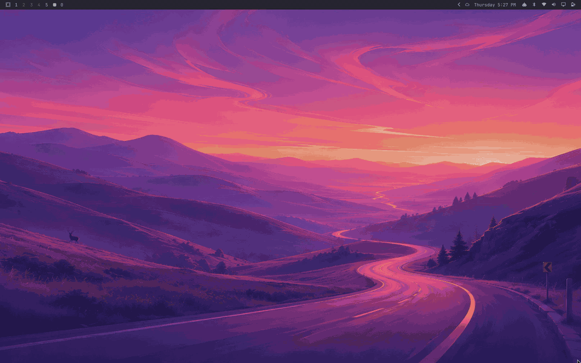
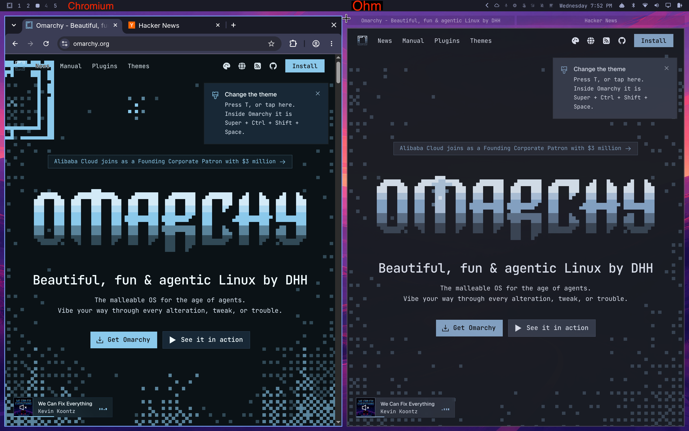

# Ohm

**A minimal web browser for [Omarchy](https://omarchy.org): one window per page, and Hyprland is the tab bar.**

Ohm has no tabs, no toolbar and no address bar in the way (Ctrl+L brings one
up). Every page is its own window, so Hyprland does the tiling, grouping and
tab-switching that other browsers build in for themselves. Underneath it's
Chromium, via Qt WebEngine, so sites work as you'd expect: DevTools, sign-in
with passkeys from your phone, notifications, screen sharing, and web apps.

*Ohm, as in resistance to everything you don't need.*

## Quick Install

```bash
curl -fsSL https://raw.githubusercontent.com/ijt/ohm/main/install.sh | bash
```




*Chromium on the left, Ohm on the right. Same two tabs; in Ohm they're a Hyprland group.*

*Chromium has too much chrome. Zen is a step closer, but Ohm lets Hyprland take us a step beyond.*

Browsers grew tabs and split views because the desktop couldn't manage their
windows well. Hyprland can, so Ohm leaves that job to it.

## Why it starts quickly

The app itself is the warm daemon — no separate hidden window needed to keep it alive. `ohm.service` runs it with zero windows open; opening a page asks the already-running process for a new window over a local socket. Warm opens measure well under 150ms, not seconds.

## What Ohm is (and is not)

| Is | Is not |
|----|--------|
| Default browser (links, Super+Shift+B once set) | An extension platform |
| One window per page; Hyprland groups are tabs | A full Chrome/Firefox replacement for every workflow |
| Theme-aware omnibox via Omarchy hooks | |
| A web app host (`ohm --app=URL`: permission prompts, notifications, screen sharing) | |

Omarchy's `omarchy-launch-webapp` sends web apps to Chromium unless your default browser is on its list, and Ohm isn't on it yet. So when Ohm becomes your default, the installer points your web app entries at `ohm --app=URL` directly (and puts them back on uninstall). Web apps you add later are picked up the next time you run `ohm default` or reinstall. Chromium remains the right tool for Chromium extensions. Ohm is for the web on a tiling compositor.

## Install

Ohm is built for Omarchy. It should also work on other Arch-based setups
that have:

- **Hyprland** with a Lua config (`~/.config/hypr/hyprland.lua`). Hyprland
  groups serve as Ohm's tabs.
- **pacman**, which the installer uses to fetch Qt 6 WebEngine, CMake, Rust,
  and Lua 5.4.
- **systemd user services**, which keep Ohm's warm daemon running.

Omarchy also provides the theme syncing and the Quickshell downloads and
shortcuts panels. Without Omarchy, the installer skips those parts.

### One-line (Omarchy)

The [Quick Install](#quick-install) command above runs
[`install.sh`](install.sh), which installs any missing packages via `pacman`
(asking first), clones to `~/.local/share/ohm/src` (or updates it if
it's already there -- re-running the command later is how you upgrade),
checks out the newest [release](https://github.com/ijt/ohm/releases),
and does exactly what "From source" below does. Read it before piping it
into `bash` if you'd rather not take that on faith.

To install something other than the newest release, set `OHM_REF` to
a tag, branch or commit. For the latest unreleased code:

```bash
curl -fsSL https://raw.githubusercontent.com/ijt/ohm/main/install.sh | OHM_REF=main bash
```

### From source (Omarchy / Hyprland)

```bash
git clone https://github.com/ijt/ohm.git
cd ohm
cmake -S app -B app/build
cmake --build app/build
./ohm install
```

`./ohm install` will:

- symlink `~/.local/bin/ohm`
- install the downloads view -- an Omarchy Quickshell panel (see
  [`downloads-panel/`](downloads-panel/)) opened by clicking the bottom
  progress bar -- into
  `~/.config/omarchy/plugins/ohm-downloads` and enable it
- install the shortcuts cheatsheet -- another Quickshell panel (see
  [`shortcuts-panel/`](shortcuts-panel/)) opened with `Ctrl+?` or `F1` --
  into `~/.config/omarchy/plugins/ohm-shortcuts` and enable it
- restart the Omarchy shell if either panel changed since the last install,
  since a running shell keeps showing the old one
- enable `ohm.service` so the daemon is warm after login
- rebind `Super + Shift + Return` to Ohm and `Super + Shift + Y` to YouTube in Ohm
- tag Ohm windows like other Chromium-family browsers
- leave your default browser alone: it never prompts. To make Ohm the
  default for links, `Super + Shift + B` and web apps, run `ohm default`
  (the install output ends with that hint).

```bash
./ohm uninstall   # data is left in ~/.local/share/ohm
```

### Packaged (Arch / Omarchy)

Download the latest `ohm-*-x86_64.pkg.tar.zst` from
[Releases](https://github.com/ijt/ohm/releases) and:

```bash
sudo pacman -U ohm-*-x86_64.pkg.tar.zst
systemctl --user enable --now ohm.service
```

A rolling `ohm-git` PKGBUILD lives in [`packaging/`](packaging/). Build/install from a clone:

```bash
cd packaging
makepkg -si
systemctl --user enable --now ohm.service
xdg-settings set default-web-browser ohm.desktop
```

Once Omarchy lists Ohm under *Install > Browser*, the intended path is:

```bash
omarchy install browser ohm
omarchy default browser ohm
```

### System install layout (`cmake --install`)

```
/usr/bin/ohm
/usr/lib/ohm/ohm-bin
/usr/lib/ohm/ohm-passkey
/usr/share/applications/ohm.desktop
/usr/share/icons/hicolor/128x128/apps/ohm.png
/usr/share/ohm/downloads-panel/
/usr/share/ohm/shortcuts-panel/
/usr/lib/systemd/user/ohm.service
```

The Quickshell panels at `/usr/share/ohm/downloads-panel/` and
`/usr/share/ohm/shortcuts-panel/` are only staged there by packaged
installs, same as `hypr.lua` -- `./ohm install` (source-tree only) is
what actually copies plugins into `~/.config/omarchy/plugins/` and enables
them with Quickshell.

## Keys

Browser (inside a Ohm window):

| Key | Action |
|-----|--------|
| `Ctrl + T` | New empty page in the current Hyprland group (creates the group if needed) |
| `Ctrl + Shift + T` | Reopen the last closed page, with its back history, in the current group |
| `Ctrl + N` | New empty page as a standalone window |
| `Ctrl + L` / `Ctrl + K` | Edit this window's address (whole address selected, so typing replaces it). Escape goes back. |
| `Alt + Left` | Back (configurable, see [Configuration](#configuration)) |
| `Ctrl + F` | Find in page. Enter/Shift+Enter or the ↓/↑ buttons step through matches, Escape closes it. |
| `Ctrl + R` | Reload the page |
| `Ctrl + =` / `Ctrl + -` | Zoom in / zoom out |
| `F12` / `Ctrl + Shift + I` | Developer tools (Chromium's DevTools) in their own window; again to close. Right-click → Inspect jumps to an element. |
| `Ctrl + W` / `Super + Q` | Close this page |
| `Ctrl + ?` / `F1` | Shortcuts and command palette: type to filter (`reopen`, `zoom`), Enter runs it |

Hyprland groups (these are the tabs):

| Key | Action |
|-----|--------|
| `Super + G` | Toggle group on the focused window. New windows join an unlocked group. |
| `Super + Ctrl + Left/Right` | Cycle pages in the group |
| `Super + Alt + 1/2/3/4` | Jump to grouped window N |
| `Super + Alt + G` | Pull this window out of the group |
| `Super + G` again | Disband the group |

## Phone passkeys

Sign in with a passkey on your phone, the same QR-code flow Chrome calls
"use a phone or tablet". When a site asks for a passkey, Ohm shows a QR
code; scan it with your iPhone's or Android phone's camera and approve with
Face ID or your fingerprint. That covers passkeys kept in iCloud Keychain,
Google Password Manager, or a password manager on the phone (1Password,
Bitwarden, ...). Tested with Google, X, and GitHub on an iPhone.

- **Unlock the phone first.** iOS will create a passkey from the lock-screen
  camera, but it won't sign in with one ("This passkey could not be used to
  sign in").
- **Bluetooth** has to be on for both the computer and the phone. The phone
  proves it's nearby over Bluetooth; that's what stops a phishing site
  from relaying your sign-in.
- The rest travels through Apple's or Google's relay, end-to-end encrypted,
  the same way it does for Chrome.

This is `ohm-passkey`, a small Rust helper built on
[libwebauthn](https://github.com/linux-credentials/libwebauthn) (LGPL-2.1+)
that the build compiles when `cargo` is installed. Ohm takes the site's
origin from the browser engine, never from the page, and the helper checks
the passkey's site against it. Not yet: passkey autofill in username
fields, and "remember this phone".

## Configuration

Ohm reads `~/.config/ohm/config.lua` (a real Lua file, executed with an embedded Lua 5.4 interpreter) fresh every time a new window opens — no restart needed, even against a daemon that's been running for days; just open a new window (`Ctrl+T`/`Ctrl+N`, or `Super+Shift+Return`) after editing the file. Two settings so far:

```lua
-- Search fallback for whatever the omnibox doesn't recognize as a URL.
-- "%s" is replaced with the percent-encoded query. Defaults to DuckDuckGo
-- (below) if config.lua doesn't set this, or doesn't exist at all.
search_engine = "https://www.google.com/search?q=%s"

-- Browser-back shortcut, as a Qt key-sequence string. Defaults to
-- Chromium's own default, Alt+Left.
back_shortcut = "Ctrl+["
```

The file is optional — no `config.lua` (or a broken one) just falls back to the defaults. A broken one (syntax error, a `search_engine` missing the `%s` placeholder, or a `back_shortcut` that isn't a valid key sequence) also fires a desktop notification saying why, so it's never silent.

It's real Lua, so either setting can be computed however you like (env vars via `os.getenv`, a `case`-style table keyed on hostname, etc.) — `search_engine` just has to end up a string containing `%s`, and `back_shortcut` a string Qt's `QKeySequence` recognizes (the same syntax as this table's `Alt+Left`).

#### Search engines

| Engine | `search_engine` |
|---|---|
| DuckDuckGo (default) | `https://duckduckgo.com/?q=%s` |
| Google | `https://www.google.com/search?q=%s` |
| Bing | `https://www.bing.com/search?q=%s` |
| Brave Search | `https://search.brave.com/search?q=%s` |
| Kagi | `https://kagi.com/search?q=%s` |
| Startpage | `https://www.startpage.com/sp/search?query=%s` |
| A self-hosted SearXNG instance | `https://<your-instance>/search?q=%s` |

## Notes

- Dedicated QtWebEngine profile at `~/.local/share/ohm/profile/webengine` — your main Chromium logins are untouched.
- `Ctrl+T` opens a new empty page in the same Hyprland group as this window (and makes a group if there isn't one yet). `Ctrl+N` opens a new empty window of its own. `Ctrl+L` edits the address in this window, whole address selected. Escape goes back. On the empty gate, Ctrl+L is a no-op.
- `Super + Shift + B` stays Omarchy's default-browser launcher (`omarchy-launch-browser` / XDG) until you run `ohm default` / `omarchy default browser ohm`.
